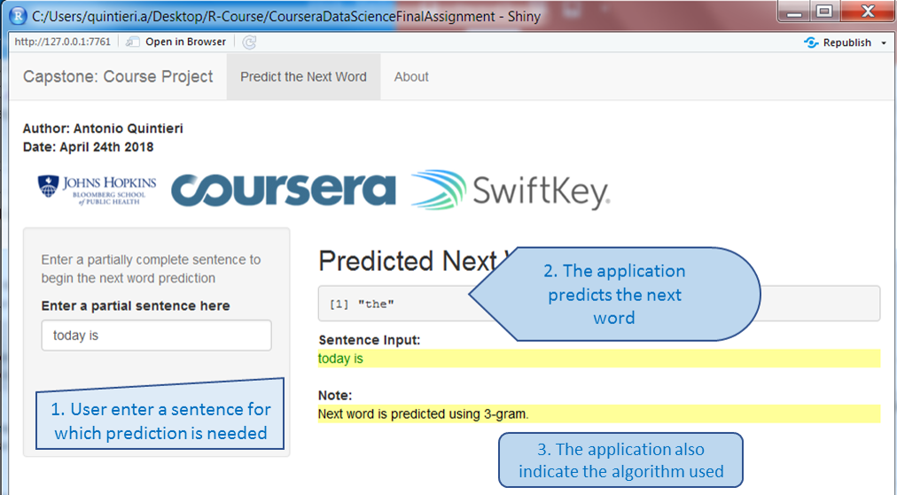

Coursera Data Science Capstone: Final Assignment
========================================================
- author: Antonio Quintieri
- date: April 25th 2018

Overview
========================================================

If you haven't tried out the app, go [here](https://antoraf.shinyapps.io/CourseraDataScienceFinalAssignment/) to try it!

- Predicts next word as the user types a sentence
- Similar to the way most smart phone keyboards are implemented today using the technology of Swiftkey

How To Use the App
========================================================

Getting & Cleaning the Data
========================================================

- A subset of the original data was sampled from the three sources (blogs,twitter and news) which is then merged into one.
- Next, data cleaning is done by conversion to lowercase, strip white space, and removing punctuation and numbers.
- The corresponding n-grams are then created (Quadgram,Trigram and Bigram).
- Next, the term-count tables are extracted from the N-Grams and sorted according to the frequency in descending order.
- Lastly, the n-gram objects are saved as R-Compressed files (.RData files).

Underlying Algorithm
========================================================

- N-gram model with "Stupid Backoff" ([Brants et al 2007](http://www.cs.columbia.edu/~smaskey/CS6998-0412/supportmaterial/langmodel_mapreduce.pdf))
- Checks if highest-order (in this case, n=4) n-gram has been seen. If not "degrades" to a lower-order model (n=3, 2); we would use even higher orders, but ShinyApps caps app size at 100mb

Further Exploration
========================================================

- The code is available on [GitHub](https://github.com/antoraf/CourseraDataScienceFinalAssignment)
- Further work can expand the main weakness of this approach: long-range context
    1. Current algorithm discards contextual information past 4-grams due to the low accurency of 4-grams sentences into the data set. 
    2. We can incorporate this into future work through clustering underlying training corpus/data and predicting what cluster the entire sentence would fall into
    3. This allows us to predict using ONLY the data subset that fits the long-range context of the sentence, while still preserving the performance characteristics of an n-gram and Stupid Backoff model
